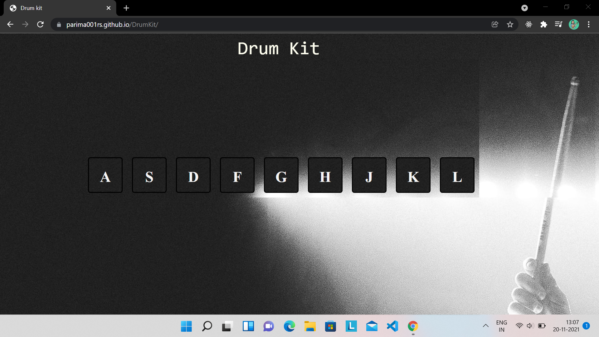
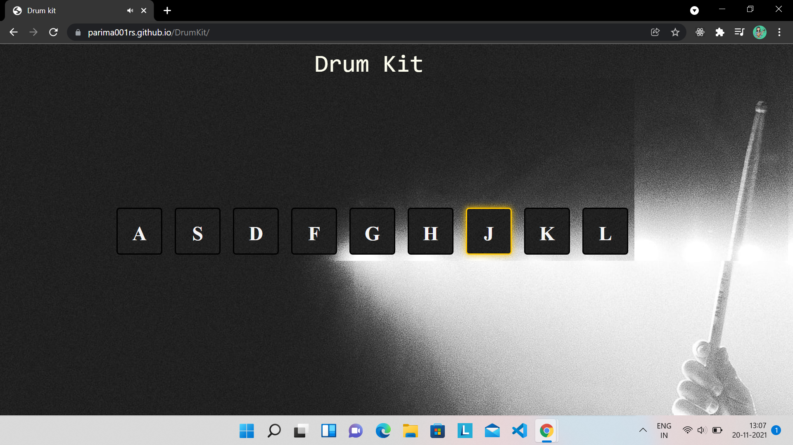

# DrumKit
### How to use?
> Tab the keys (on keyboard) displayed on the screen.

## Languages used
 HTML
 CSS
 Vanilla JavaScript

This project is hosted using **Github Pages**
[Deployed project link](https://parima001rs.github.io/DrumKit/)

## Preview





## Steps to access it locally➡️
##### Commands:

> cd over to your desired location
 
```cd <path>```


> to clone the project to your local directory
 
`git clone https://github.com/parima001rs/DrumKit.git`
